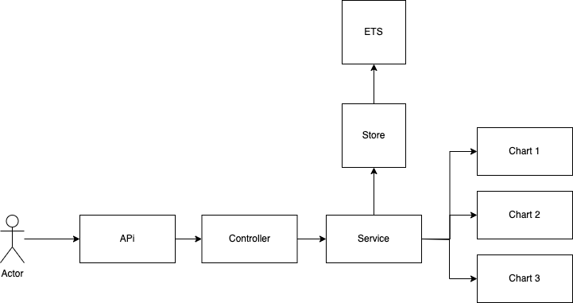

# Kantox

## Assignment 
I am the lead programmer for a small chain of supermarkets.
It'was requested to make a simple cashier function that adds products to a cart and displays the total price.
As a default we have the following products:

| CODE | Name | Price |
| --- | --- | --- |
| GR1 | Green tea | 3.11|
| SR1 | Strawberries | 5.00|
| CF1 | Coffee | 11.23|
  
Special conditions:
  *  The CEO is a big fan of buy-one-get-one-free offers and of green tea. He wants us to add a rule to do this.
  * The COO, though, likes low prices and wants people buying strawberries to get a price
discount for bulk purchases. If you buy 3 or more strawberries, the price should drop to £4.50
per strawberry.
  * The CTO is a coffee addict. If you buy 3 or more coffees, the price of all coffees should drop
to two thirds of the original price.
Our check-out can scan items in any order, and because the CEO and COO change their minds often,
it needs to be flexible regarding our pricing rules.
Implement a checkout system that fulfills these requirements.

Test data
  Basket: GR1,SR1,GR1,GR1,CF1
Total price expected: £22.45
  Basket: GR1,GR1
Total price expected: £3.11
  Basket: SR1,SR1,GR1,SR1
Total price expected: £16.61
  Basket: GR1,CF1,SR1,CF1,CF1
Total price expected: £30.57


## Architecture




It's really simple architecture so we receive calls from users, we process them and return response.
Depending of the request que might access our Kantox.Store Module / ETS or our `Charts`.
A Chart it's a GenServer worker Controlled by a DynamicSupervisor, so in this way we can scale
later our system in the case our small supermarket grows.

Currently we have defined as default 3 [Charts Users](#charts-users) but more can be added if needed.

### Charts users

|Charts Users|
| ---- |
|chart_1|
|chart_2|
|chart_3|

### Store
Our data model is composed mainly for 2 models

| | | | Products Table | |
| - |- | - | - | - |
|FIELD | REQUIRED FIELD? |TYPE|DESCRIPTION|
| id | True | Integer | It's the product identifier |
| name | True | Integer | It' the prodcuts name |
| price | True | Number | It indicates how much users must pay to acquire the product |
| promotion | False | Promotion | It indicates if the product has some promotion | 

|  | | |Promotion Table | |
| - |- | - | - | - |
| FIELD | REQUIRED FIELD? | TYPE | DESCRIPTION |  
| condition | True | enum Condition (grater_than, get_elements_pay_discount) | It defines the type/logic to follow in order to apply the promotion |
| elements | True | Integer | Amount of elements to reach in order to apply the promotion |
| discount | True | Number | It indicates the amount to be deducted from the original price when the promotion is applied|

We are using as DB ETS but it is possible to switch to any other Storage system as far we create a module
that implements `Kantox.Store` behaviour.


### API 

### GET /products/list
We have here and example: Request GET URL [/products/list](http://localhost:4000/products/list)

You should get a response similar like this:

```json
[
    {
        "id": "CF1",
        "name": "Coffee",
        "price": "11.23",
        "promotion": {
            "condition": "greater_than",
            "discount": "3.7436",
            "elements": 3
        }
    },
    {
        "id": "SR1",
        "name": "Strawberries",
        "price": "5.0",
        "promotion": {
            "condition": "greater_than",
            "discount": "0.5",
            "elements": 3
        }
    },
    {
        "id": "GR1",
        "name": "Green tea",
        "price": "3.11",
        "promotion": {
            "condition": "get_elements_pay_discount",
            "discount": "1",
            "elements": 2
        }
    }
]
```

### PUT /products/upsert
We have here and example: Request PUT URL [/products/upsert](http://localhost:4000/products/upsert)


Given a body params like this:

```json
{
    "id": "GR1",
    "name": "GREEN TEA",
    "price": "3.11",
    "promotion": {
        "condition": "get_elements_pay_discount",
        "discount": "1",
        "elements": 2
    }
}
```
You should get a response similar like this:

```json
{
    "id": "GR1",
    "name": "GREEN TEA",
    "price": "3.11",
    "promotion": {
        "condition": "get_elements_pay_discount",
        "discount": "1",
        "elements": 2
    }
}
```

### Body Params Available
| FIELD | REQUIRED FIELD? | TYPE | DESCRIPTION | POSSIBLES VALUES | 
|--------|-----------------|------|-------------|------------------|
| id | TRUE | String | It's the product identifier | Any string |
| name | TRUE | String | It's the products name | Any string |
| pice | TRUE | Number | Determines how much the product costs | Any positive number |
| promotion | FALSE | PROMOTION Object | Determines if the product has a promotion | null || object |


| PROMOTION FIELDS | REQUIRED FIELD? | TYPE | DESCRIPTION | POSSIBLES VALUES | 
|--------|-----------------|------|-------------|------------------|
| condition | TRUE | **Condition** | It defines the type/logic to follow in order to apply the promotion | greater_than, get_elements_pay_discount |
| discount | TRUE | Number | It indicates the amount to be deducted from the original price when the promotion is applied | Any positive number |
| elements | TRUE | Integer | Amount of elements to reach in order to apply the promotion | Any positive integer |


**Condition Type**
So currently we have 2 condition types, both strings:
  * **get_elements_pay_discount**: This type defines that if you reach the amount of **elements** you will pay the
    the value of **discount** * **price of the product** for all the **elements** defined. 
  * **greater_than**: This type defines that if you reach the amount of **elements** or overpasses, the
    discount will be applied per each product of this type present in your basket.

### POST /products/purchase
We have here and example: Request POST URL [/products/purchase](http://localhost:4000/products/purchase)


Given a body params like this:

```json
{
  "basket": ["GR1","CF1","SR1","CF1","CF1"]
}
```
You should get a response similar like this:

```json
{
  "total": "30.57"
}
```

### Body Params Available
| FIELD | REQUIRED FIELD? | TYPE | DESCRIPTION | POSSIBLES VALUES | 
|--------|-----------------|------|-------------|------------------|
| basket | TRUE | List of String | A list of products Id present in the basket to be purchased | Any string code ID in the system |


### Get /charts/basket
We have here and example: Request GET URL [/charts/basket](http://localhost:4000/charts/basket?chart_id=chart_1)

The list of charts_ids can be found [HERE](#charts-users)


Given params like this:

```json
{
  "chart_id": "chart_1"
}
```
You should get a response similar like this:

```json
{
  "basket": []
}
```

### Params Available
| FIELD | REQUIRED FIELD? | TYPE | DESCRIPTION | POSSIBLES VALUES | 
|--------|-----------------|------|-------------|------------------|
| chart_id | TRUE | String | The chart identifier | Any string code ID in the system |


### GET /charts/total_price
We have here and example: Request GET URL [/charts/total_price](http://localhost:4000/charts/total_price)

The list of charts_ids can be found [HERE](#charts-users)


Given a body params like this:

```json
{
  "chart_id": "chart_1"
}
```
You should get a response similar like this:

```json
{
  "total": "0.00"
}
```

### Params Available
| FIELD | REQUIRED FIELD? | TYPE | DESCRIPTION | POSSIBLES VALUES | 
|--------|-----------------|------|-------------|------------------|
| chart_id | TRUE | String | The chart identifier | Any string code ID in the system |


### POST /charts/products/add_product
We have here and example: Request POST URL [/charts/products/add_product](http://localhost:4000/charts/products/add_product)

The list of charts_ids can be found [HERE](#charts-users)


Given a body params like this:

```json
{
  "chart_id": "chart_1",
  "product_id": "GR1"
}
```
You should get a response similar like this:

```json
{
  "basket": ["GR1"]
}
```

### Params Available
| FIELD | REQUIRED FIELD? | TYPE | DESCRIPTION | POSSIBLES VALUES | 
|--------|-----------------|------|-------------|------------------|
| chart_id | TRUE | String | The chart identifier | Any string code ID in the system |
| product_id | TRUE | String | The product identifier | Any product code ID in the system |

### POST /charts/products/remove_product
We have here and example: Request POST URL [/charts/products/remove_product](http://localhost:4000/charts/products/remove_product)

The list of charts_ids can be found [HERE](#charts-users)


Given a body params like this:

```json
{
  "chart_id": "chart_1",
  "product_id": "GR1",
  "amount": 1
}
```
You should get a response similar like this:

```json
{
  "basket": ["GR1"]
}
```

### Params Available
| FIELD | REQUIRED FIELD? | TYPE | DESCRIPTION | POSSIBLES VALUES | 
|--------|-----------------|------|-------------|------------------|
| chart_id | TRUE | String | The chart identifier | Any string code ID in the system |
| product_id | TRUE | String | The product identifier | Any product code ID in the system |
| amount | FALSE | Integer | Number of products to be removed | Any Integer |

